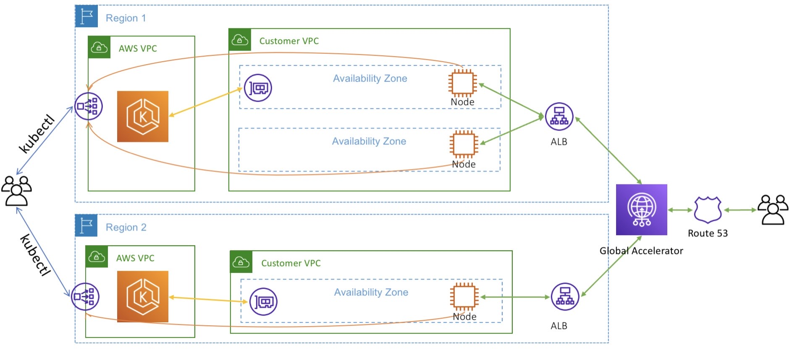

## Problem 2

With a trading system or a large business, I will deploy services to EKS is a service from AWS for easier to deploy, manage, maintain, ugprade, scale up or scale out the instances, management of containerized applications and make sure high availability (multiple regions), scalability, resilience. Nowadays, EKS community is really large so we have huge documents, tools, suppporting from community. We have multiple tools:
- Autoscale like cluster autoscaler
- ASG deploy to multiple regions
- ALB for load balancer to our services
- Limit access by security group in VPC
- Node exporter to manage node resources.
- Use ingress nginx as a reverse proxy for control the number of requests, logging, security, performance.
- EKS provide horizontal and vertical pod autoscaler also when the pod out of resource or high traffic (depend on our config).

Another suggestion is use Cloudfront for CDN and caching that help improve performance for faster delivery static content by edge locations in the world.
Another services that we have to use beside EKS:
- VPC: Virtual Private Cloud is a logically isolated virtual network that helps resources will be completely isolated from each other. It provides multiple features for security and custom network by limitation IP, port access, VPN, routing, CIDR,...
- EC2: it's just a kind of server, basic services that we need to know. We have multiple type of instances, so have to know detail to choose right instance type that help us save cost and don't affect to our business. EC2 provides some purchasing options for saving cost like: on-demand (basic type, pay as you go), reserved (reduce cost by commitment EC2 specific type for a term of 1 or 3 years, we can sell them on the AWS EC2 Reserved Instance Marketplace), saving plan (look like reserved but saving plan more flexible like modify instance family, region, OS even apply across fargate, lambda), dedicated hosts (book an entire physical server, control instance placement), spot instance (cheap but less reliable that can be terminated anytime).
- EBS: a kind of storage for mount volume to EC2 instance. It provides a range of options for storage performance, cost, encryption. Some EBS types depend on the use cases like gp2, gp3, io1, st1, sc1.
- IAM: authentication and authoration for user and role in AWS. The one of most important services in AWS for security by limit permission to AWS resources.
- Cloudwatch: a monitoring service, enables users to collect and view monitoring data for AWS resources.
- Route 53: a DNS service. More over, route 53 also any failure is detected, automatically routes the user to a healthy resource, multiple type of routing policy: failover, geolocation, latency, weighted, multivalue.
- S3: is an object storage service. S3 have also some kind of policy that save our cost by move to different zones for rarely accessed data, provides features for auditing and managing access to your buckets and objects. Good place for save static files for our frontend and improving access speed through Cloudfront CDN.
- KMS: is a service for encrypt, decrypt within your own applications and control the encryption of stored data across AWS services.
- Cloudtrail: audit, compliance monitoring tool, ensure every API call made to every resource in their AWS account is recorded and written to a log. Integrate with SNS, EventBridge for alert whenever who change any AWS resources config.
- BTW, these are just basic services that we need to know.

The diagram will be look like:

